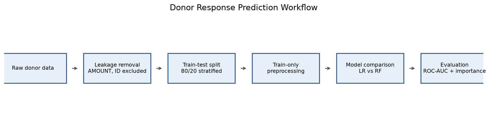
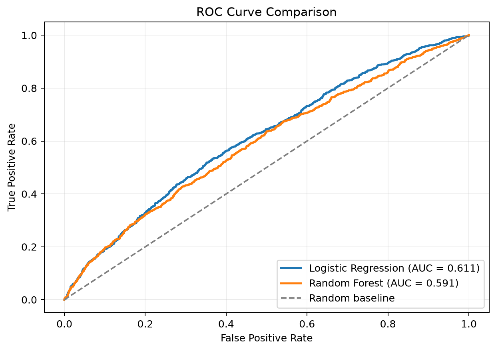
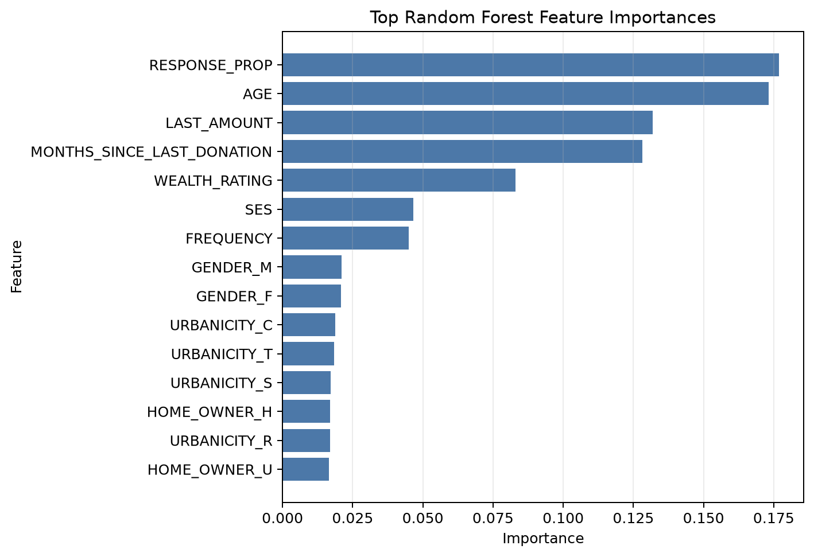
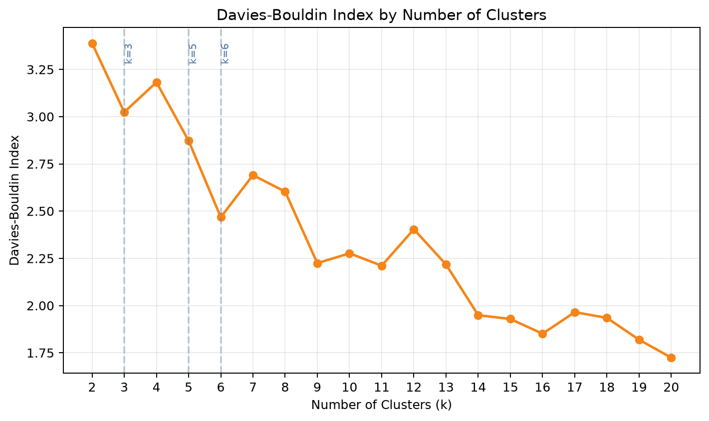
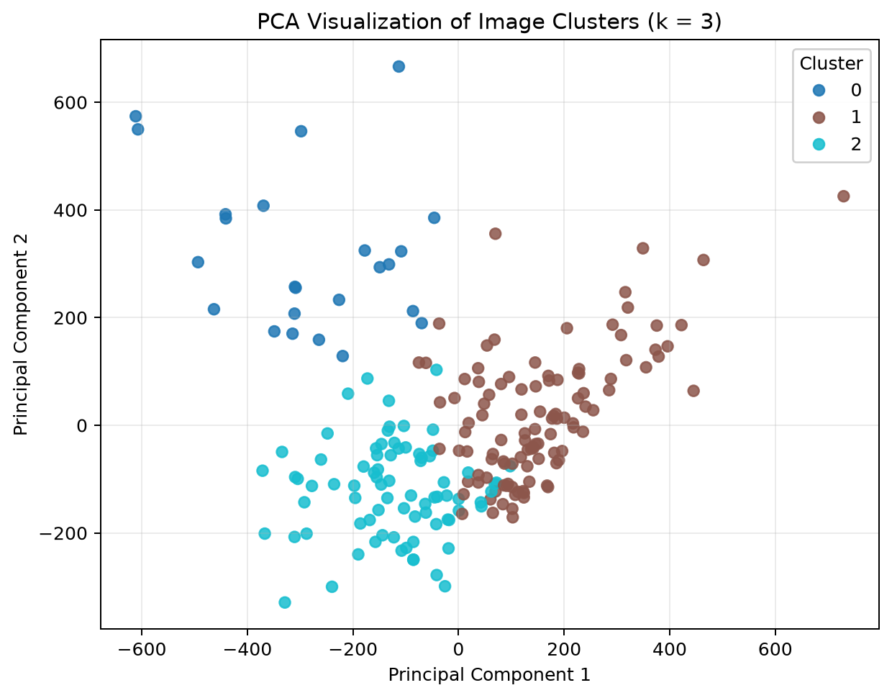
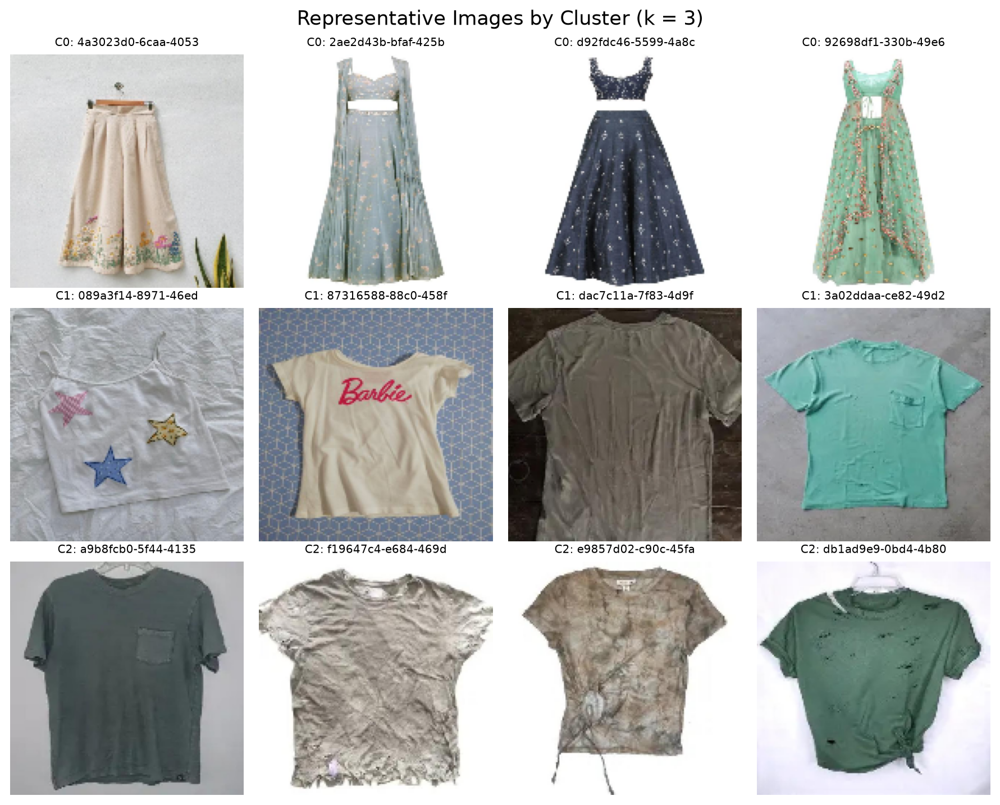

# Assets

This directory contains exported figures generated from the project workflow. These images provide a quick visual summary of the modelling and clustering results.

## Donor Response Prediction

### Workflow

### ROC Curve Comparison

### Feature Importance

## Used Clothes Image Clustering

### Davies-Bouldin Index by k

### PCA Cluster Visualization

### Representative Cluster Images

